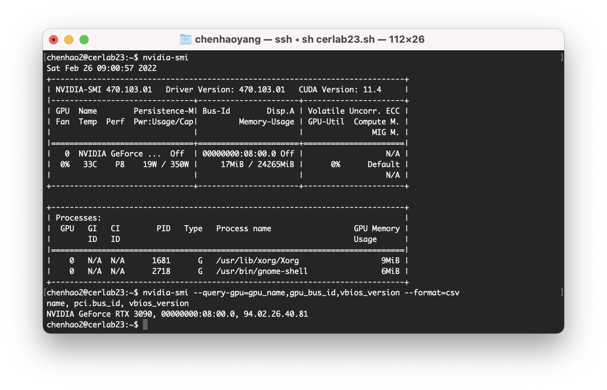
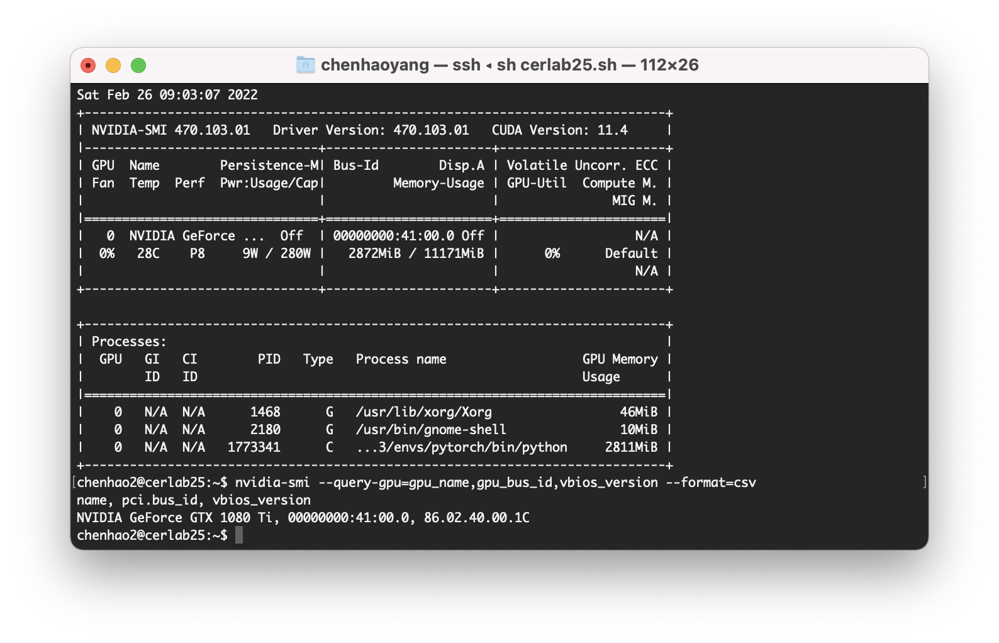

# Tutorial on configuring environment on CERLAB server

Chenhao Yang

Updated on: Feb.27.2022

---

### Step 1: Ask Tomokake for access to cerlab23 / cerlab 25 on **SLACK**

Cerlab23 has a Nvidia RTX 3090 GPU



Cerlab25 has a Nvidia GTX 1080ti GPU



### Step 2: Remote connect to server with Secure Shell (SSH)

Open terminal on your machine and type:

```shell
ssh <your_andrew_id>@cerlab23.andrew.cmu.edu
```

This should prompt you for password, you should use your CMU password.

If everything works fine, the terminal should give you:

```shell
Welcome to Ubuntu 20.04.3 LTS (GNU/Linux 5.13.0-28-generic x86_64)

 * Documentation:  https://help.ubuntu.com
 * Management:     https://landscape.canonical.com
 * Support:        https://ubuntu.com/advantage

  System information as of Sat 26 Feb 2022 09:10:22 AM EST

  System load:    0.32              Processes:               1329
  Usage of /home: 41.2% of 3.58TB   Users logged in:         1
  Memory usage:   22%               IPv4 address for enp4s0: 128.2.59.51
  Swap usage:     100%

58 updates can be applied immediately.
To see these additional updates run: apt list --upgradable

Your Hardware Enablement Stack (HWE) is supported until April 2025.
*** System restart required ***
Last login: Sat Feb 26 09:00:51 2022 from ...
<your_andrew_id>@cerlab23:~$
```

[Optional] You can exit the server using cmd: `exit`.

[Optional] Log in server without re-typing your password using ssh-keygen & ssh-copy-id: 

1. Create public and private keys using ssh-key-gen on local-host 

   ```sh
   chenhaoyang@chenhaos-air ~ % ssh-keygen
   Generating public/private rsa key pair.
   Enter file in which to save the key (/Users/chenhaoyang/.ssh/id_rsa): [Press Enter]
   Enter passphrase (empty for no passphrase): [Press Enter]
   Enter same passphrase again: [Press Enter]
   Your identification has been saved in /Users/chenhaoyang/.ssh/id_rsa
   Your public key has been saved in /Users/chenhaoyang/.ssh/id_rsa.pub
   The key fingerprint is:
   SHA256:PAleYLcvgqr+6Bqpsdz8wg8q73N1B1anq6yYAqPa/u8 chenhaoyang@chenhaos-air.wifi.local.cmu.edu
   The key's randomart image is:
   +---[RSA 3072]----+
   |      o .        |
   |     . o .. .    |
   |      . o. o     |
   |     o +oo.      |
   |    . o.S...     |
   |o. .  ...oo      |
   |=oo. . o o       |
   |=*Booo  o        |
   |%X*OB=E.         |
   +----[SHA256]-----+
   ```

2. Copy the public key to remote-host using ssh-copy-id 

   ```shell
   ssh-copy-id -i ~/.ssh/id_rsa.pub <your_andrew_id>@cerlab23.andrew.cmu.edu
   ```

3. Login to remote-host without entering the password

   ```shell
   ssh <your_andrew_id>@cerlab23.andrew.cmu.edu
   ```

   If everything works fine, you don't need to re-enter password every time you log in on your machine.

   

There are other useful commands, e.g. transferring files from your local machine to the server, here is a good resource: [Using Files & Commands](https://www.cs.cmu.edu/~15131/f16/topics/terminal-usage/files-commands/).

### Step 3: Install miniconda on server

In this tutorial, we are going to use miniconda for configuring python environment, you can also use Anaconda.

First, install the latest miniconda package by:

```shell
curl -fsSLO https://repo.continuum.io/miniconda/Miniconda3-latest-Linux-x86_64.sh
bash Miniconda3-latest-Linux-x86_64.sh
# Accept EULA
# Install in default directory
# Select no for editing .bashrc
```

Then, update your bashrc like so:

```shell
echo "source $HOME/miniconda3/etc/profile.d/conda.sh" >> ~/.bashrc
```

Unfortunately, when you open a new terminal, the server will not run `~/.bashrc` automatically. You have to type the following command **everytime you log in** in order to use conda commands:

```shell
source ~/.bashrc
```

If everything works well, you should be able to see:

```shell
(base) <your_andrew_id>@cerlab23:~$
```

It means conda is now ready to use.

[Optional] Configure `conda` to use strict channel priority (will speed up solving the environment) and to not automatically activate the default env (will force you to activate a specific env):

```shell
 conda config --set channel_priority strict
 conda config --set auto_activate_base False
```

Then, we can start with creating an environment with conda:

```shell
conda create -n myenv
```

And activate:

```shell
conda activate myenv
```

For other conda commands and installing packages, please refer to [Managing environments](https://docs.conda.io/projects/conda/en/latest/user-guide/tasks/manage-environments.html#).


### [Optional] Step 4: installing MMdetection

[MMdetection](https://github.com/open-mmlab/mmdetection) is an open source object detection toolbox based on PyTorch.

1. Create a conda virtual environment and activate it.

   ```shell
   conda create -n openmmlab python=3.7 -y
   conda activate openmmlab
   ```

2. Install PyTorch and torchvision 11.3 (should support our lab server)

   ```shell
   conda install pytorch torchvision torchaudio cudatoolkit=11.3 -c pytorch
   ```

   [Recommanded] Check if cuda-version PyTorch is used:

   ```shell
   (openmmlab) your_andrew_id@cerlab23:~$ python
   Python 3.9.7 (default, Sep 16 2021, 13:09:58) 
   [GCC 7.5.0] :: Anaconda, Inc. on linux
   Type "help", "copyright", "credits" or "license" for more information.
   >>> import torch
   >>> a=torch.Tensor([0]).cuda()
   >>> a
   tensor([0.], device='cuda:0')
   ```

3. Install MMDetection with [MIM](https://github.com/open-mmlab/mim), which automatically handle the dependencies of OpenMMLab projects, including mmcv and other python packages.

   ```shell
   pip install openmim
   mim install mmdet
   ```

4. Git clone open mmdetection:

   ```shell
   git clone https://github.com/open-mmlab/mmdetection.git
   ```

   The git repo should be cloned to server at `~/mmdetection`

5. Test run:

   ```shell
   cd mmdetection
   mkdir checkpoints
   ```

   Download a pretrained network (Mask-R-CNN):

   ```shell
   wget -c https://download.openmmlab.com/mmdetection/v2.0/mask_rcnn/mask_rcnn_r50_caffe_fpn_mstrain-poly_3x_coco/mask_rcnn_r50_caffe_fpn_mstrain-poly_3x_coco_bbox_mAP-0.408__segm_mAP-0.37_20200504_163245-42aa3d00.pth \
         -O checkpoints/mask_rcnn_r50_caffe_fpn_mstrain-poly_3x_coco_bbox_mAP-0.408__segm_mAP-0.37_20200504_163245-42aa3d00.pth
   ```

   Use `video_demo.py` in `/demo` to get the result:

   ```shell
   python demo/video_demo.py 'demo/demo.mp4' 'configs/mask_rcnn/mask_rcnn_r50_caffe_fpn_mstrain-poly_3x_coco.py' 'checkpoints/mask_rcnn_r50_caffe_fpn_mstrain-poly_3x_coco_bbox_mAP-0.408__segm_mAP-0.37_20200504_163245-42aa3d00.pth' --out 'demo/result.mp4'
   ```

   The result is saved at `mmdetection/demo/result.mp4`, you can either use scp or remote GUI tools to get the data on your local machine.


### [Optional] Access remote code in a breeze with JupyterLab via SSH

This is a nice-to-have feature, so you can do everything on Jupyter Lab with similar pipeline on your local machine.

1. SSH to CERLAB server;

2. Activate your conda environment;

3. Install Jupyterlab:

   ```shell
   conda install jupyterlab
   ```

4. Open Jupyterlab on server

   ```shell
   jupyter lab --no-browser --port 8887
   ```

   You can use other ports if 8887 is taken(maybe other lab member is using).

   It should give you output like:

   ```shell
   [I 2022-02-26 11:13:57.456 ServerApp] jupyterlab | extension was successfully linked.
   ...
       To access the server, open this file in a browser:
           file:///home/your_andrew_id/.local/share/jupyter/runtime/jpserver-1276972-open.html
       Or copy and paste one of these URLs:
           http://localhost:8887/lab?token=a7231fb9108f5b79337b7b44e93c19224b7be4288e71f545
        or http://127.0.0.1:8887/lab?token=a7231fb9108f5b79337b7b44e93c19224b7be4288e71f545
   ```

   Don't close the terminal, it will keep the jupyterlab run open server. The token will be used later.

5. On your local machine, run:

   ```shell
   ssh -N -L localhost:8887:localhost:8887 <your_andrew_id>@cerlab23.andrew.cmu.edu
   ```

   And type in your password.

6. On your local machine, open a webpage with address:

   ```shell
   http://localhost:8887/ 
   ```

7. Type in the token that appeared in step 4, then the Jupiter notebook should appear.

